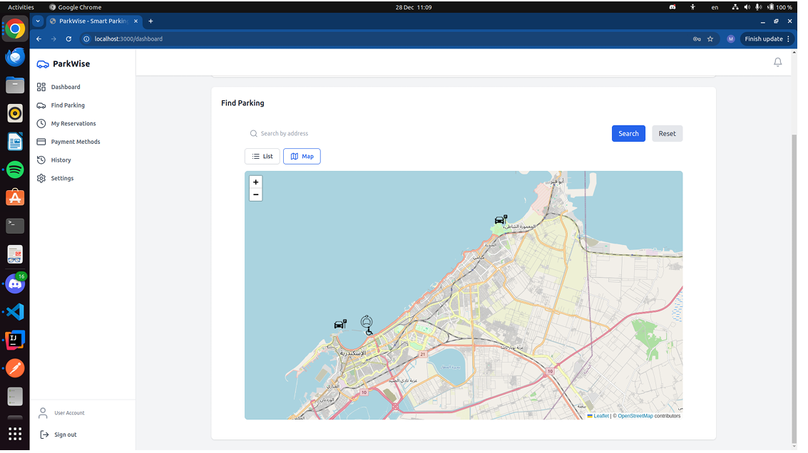

# Smart City Parking Management System

## Project Overview
The Smart City Parking Management System is designed to optimize parking in urban areas. The system connects parking lots, parking meters, and users (drivers) through a centralized database. The goal is to manage parking availability, reservations, pricing, and traffic flow effectively, with real-time updates. This system introduces IoT-style interaction for smart city applications, where each parking spot is monitored and reported in real-time to users.

## Table of Contents
- [Smart City Parking Management System](#smart-city-parking-management-system)
  - [Project Overview](#project-overview)
  - [Table of Contents](#table-of-contents)
  - [Project Structure](#project-structure)
  - [Technology Stack](#technology-stack)
  - [Git Workflow and Conventions](#git-workflow-and-conventions)
    - [Branching Strategy](#branching-strategy)
    - [Workflow](#workflow)
    - [Commit Messages](#commit-messages)
    - [Pull Requests](#pull-requests)
  - [Development Setup](#development-setup)
    - [Prerequisites](#prerequisites)
    - [Running Locally](#running-locally)


## Project Structure
```
smart-city-parking/
|-- backend/
|   |-- src/main/java/
|   |   |-- com/smartcityparking/
|   |       |-- config/          # Configuration classes
|   |       |-- controllers/    # REST controllers
|   |       |-- models/         # Data models
|   |       |-- repositories/   # JDBC repositories
|   |       |-- services/       # Service classes
|   |-- src/main/resources/
|       |-- application.properties  # Spring configuration
|-- frontend/
|   |-- public/                # Publicly accessible files
|   |-- src/
|       |-- components/        # React components
|       |-- hooks/             # Custom hooks
|       |-- pages/             # Page-level components
|       |-- services/          # API calls and integrations
|       |-- styles/            # CSS/SCSS files
|-- database/
|   |-- scripts/               # SQL scripts for schema and data
|   |-- erd/                   # ER diagrams and designs
|-- docs/                      # Documentation files
|-- .gitignore                 # Git ignore rules
|-- README.md                  # Project overview and conventions
```

## Technology Stack
- **Backend:** Spring Boot with JDBC
- **Frontend:** React + TypeScript
- **Database:** MySQL
- **Testing:** JMeter/Gatling
- **IoT Simulation:** Python


---

## Screenshots

### Admin Dashboards

- **Admin Revenue Dashboard**
  

- **Admin Signup for Parking Lot**
  

---

### Parking Manager Views

- **Dashboard**
  

- **Reservation View**
  

---

### Driver/User Views

- **User Login**
  

- **Navigation to Parking Lot**
  

- **Parking Lot Map View**
  

- **Parking Lot List View**
  

- **Reservation List**
  

---


## Git Workflow and Conventions

### Branching Strategy
- **Main Branch:** `main` - Production-ready code only.
- **Feature/Hotfix Branches:** Branch names must follow the naming convention:
  `{TYPE}-lower-case-name-with-dashes-only-{INITIALS}`
  - **TYPE:**
    - `FT` for Feature
    - `RF` for Refactor
    - `FIX` for Fix
  - **INITIALS:** 2-letter initials of the developer creating the branch (AA,EA,AM,ME).
  - **Examples:**
    - `FT-initialize-project-AA`
    - `FIX-parking-spot-bug-ME`

### Workflow
1. Create a branch from `main`.
2. Implement changes.
3. Open a Pull Request (PR) to merge your branch into `main`.
4. PRs must be reviewed and approved by at least one other developer.

### Commit Messages
- Use descriptive commit messages.

### Pull Requests
- Assign a reviewer.
- Include a clear description of changes and testing steps.


## Development Setup
### Prerequisites
- Node.js v16+
- Java 21+
- MySQL Server

### Running Locally
1. **Backend Setup**
   - Navigate to the `backend/` directory
   - Copy `src/main/resources/templates/env.properties.template` to `src/main/resources/env.properties`
   - Set the `DB_URL`, `DB_USERNAME`, and `DB_PASSWORD` variables in `src/main/resources/env.properties` according to your development environment
   - Run `mvn clean install` to install dependencies
   - Run `mvn spring-boot:run` to start the application

2. **Frontend Setup**
   - Navigate to the `frontend/` directory
   - Run `npm install` to install dependencies
   - Run `npm start` to start the development server

3. **Database Setup**
   - Navigate to the `scripts/` directory
   - Run the `init.sql` script to set up the initial database schema

4. **IoT Simulator Setup**
   - Navigate to the `simulator/` directory
   - Run `pip install -r requirements.txt` to install dependencies
   - Run the simulation script to start updating parking spot statuses
